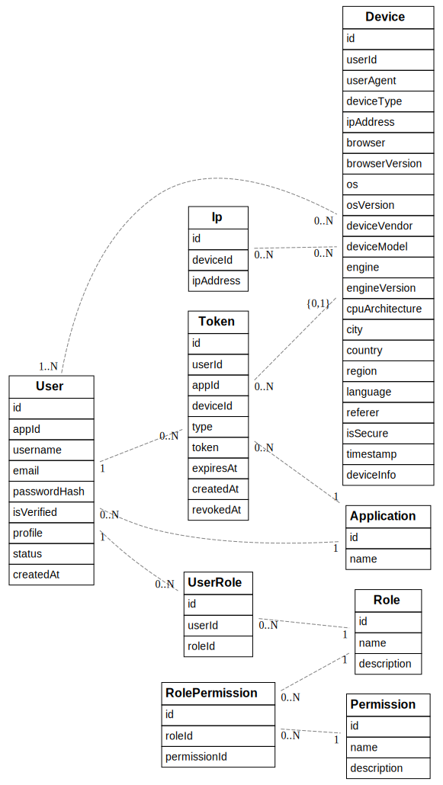

# User Service API

This service streamlines user management by offering clear authentication, authorization, and profile management workflows. The ability to manage roles and permissions allows fine-grained control over what users can do. Whether building a simple web app or a complex platform, this API is designed to be easy to integrate with your application, providing secure and customizable user services.

- [Features](#features)
- [Getting Started](#getting-started)
- [Documentation and Configuration](#documentation-and-configuration)

## Features

- **User Authentication & Authorization:** Secure login and registration with JWT-based authentication.
- **Role & Permission Management:** Assign roles to users and define fine-grained permissions for access control.
- **Password Reset:** Provide password reset functionality with email-based verification.
- **Email Verification:** Verify email addresses for new users before full access is granted.
- **Device Tracking:** Track devices that users are logged in from.
- **Token Management:** Create, refresh, and revoke authentication tokens.
- **Multi-Tenant Support:** Manage user accounts across different applications or services, ensuring isolation of data.

## Getting Started

### Prerequisites

- Node.js (>= 14.x)
- npm (>= 6.x)
- MongoDB

---

1.  ### Install dependencies:

    ```sh
    npm install
    ```

2.  ### Set up environment variables:

    Create a `.env` file in the root directory and add the following variables:

    ```env
    NODE_ENV=development   # Set the environment (development, production, etc.)
    PORT=9000              # Port on which the server will run
    DATABASE_URL=mongodb://localhost:27017/user-service   # MongoDB connection URL
    AUTH_JWT_SECRET=your_jwt_secret  # Secret key for JWT signing
    ```

3.  ### Apply the Database schema

    ```sh
    npm run migrate:dev
    ```

4.  ### Seeding the Database

    To seed the database with initial data, run:

    ```sh
    npm run seed
    ```

    > **Note:** Ensure that the `NODE_ENV` is not set to `production` when running the seed script.

5.  ### Running the Application

    - #### Development

      To start the application in development mode with hot-reloading:

      ```sh
      npm run start:dev
      ```

    - #### Production

      To build and start the application in production mode:

      ```sh
      npm run build
      npm start
      ```

## Documentation and Configuration

### API Documentation

The API documentation is available at the `/swagger` endpoint once the server is running. It provides detailed information about the available endpoints, request parameters, and responses.

### Configuration

Configuration settings are managed using the `config` package. You can find the configuration files in the `config` directory. The following environments are supported:

- `default.json`: Default configuration
- `development.json`: Development-specific configuration
- `production.json`: Production-specific configuration
- `custom-environment-variables.json`: Environment variable mappings

### Project Structure

```
src/
├── core/                   # Core utilities and middlewares
├── data/                   # Database connection and schema
├── docs/                   # Swagger API documentation
├── rest/                   # REST API routes
├── service/                # Business logic and services
├── types/                  # TypeScript types
├── index.ts                # Application entry point
config/                     # Configuration files
```

<br>


